# **Guidelines – Transcriboquest 2025**

Participants : Augé Sophie, Dedieu Alexia, Jambe Ariane, La Veglia Andrea, Rousseau Nathalie, Vergara Claudio  
Trainers : Federica Nicolardi, Marianne Reboul

Introduction : This document outlines a proposed set of transcription guidelines for the Handwritten Text Recognition (HTR) of Ancient Greek documents, intended to support the development of generalizable and robust HTR models. This document is based on the existing work in progress from TranscriboQuest2024 and DH2025 (Maxime Guénette,  Marianne Reboul, Mathilde Verstraete, Mathenia Vlachou Efstathiou). For further reference : Ὅσοι ἄνθρωποι, τοσαῦται γνῶμαι. Harmonizing Guidelines for Handwritten Text Recognition of Ancient Greek, DH2025, Lisbon, July 14-18th, 2025\. [https://dhtr25.anthologiagraeca.org/](https://dhtr25.anthologiagraeca.org/)).

1. # Abbreviations

| Image | Explanation | Unicode representation | Code |
| :---- | ----- | :---- | :---- |
|  | \-εν | ⸦ | U+2E26 |
| 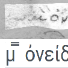 | \-ον | \\ | U+1D23B |
| 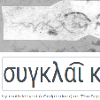 | \-ων  | ͡  | U+0361 |
| 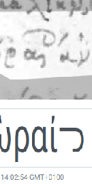 | \-οις | ᓓ | U+14D3 |
| 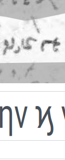 | καὶ | ϗ | U+03D7 |
| 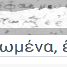 | ? | ⌇ | U+2307 |
| 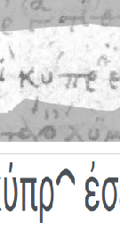 | \-ιν | ◠ | U+25E0 |
| 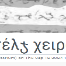 | \-ους | ჯ | U+10EF |
| 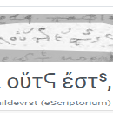 | \-ως | ᕋ | U+154B |
| 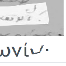 | \-ασ | ✓ | U+2713 |
| 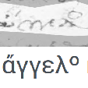 | γγ | സ | U+0D38 |
| 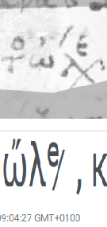 | σε (?) | ̷  | U+0337 |
| 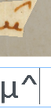 | ην | ^ | U+005E |
| 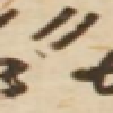 | \-ειν | ˶ | U+02F6 |
| 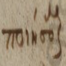 | \-μ+αι Lower final sign for contracting  \-αι mid and end of word | μƫ | letter \+ U+01AB |
| 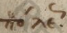 | Upper final sign for ως | ᖦ  | U+15A6 |
| 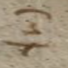 | upper final vertical sign | ᕊ  | U+154A |
| 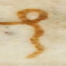 | θαι | ſ | U+017F |
| 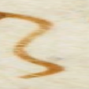 | αι | 𐤍 | U+1090D |
| 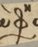 | φησι(ν) | ⍎ʰ | U+234E+U+02B0 |
| 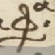 | φασι(ν) | ⍎ᵃ | U+234E+ᵃ |
| 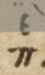 | περὶ | πᵉ | U+03C0 \+ U+1D49 |

2. # Ligatures

   **⚠ Warning :** it has been discussed that ***ligatures*** should be developed if their representation could visually contain part of the letters included. When ligatures are completely graphically different from their meaning, it could be replaced by a potential corresponding unicode character.

| Image | Explanation | Unicode representation | Code |
| :---: | :---: | :---: | :---: |
| 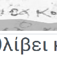 | \-ει | ? | ? |
| 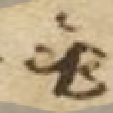 | ἑβ | ἑβ |  |
| 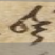 | εξ | εξ |  |
| 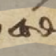 | έσθ | έσθ |  |
| 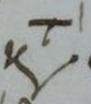 | κατὰ | κᵗ |  |
| 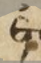 | ἐτ | ἐτ |  |
| 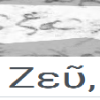 | ευ | ευ  | U+1D49 \+ U+03C5 |
| 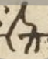 | επ | ᵉπ | U+1D49 \+ U+03C0 |
| 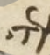 | ετ | τᵉ | U+03C4 \+ U+1D49 |
| 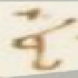 | εἰ | εἰ |  |
| 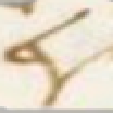 | εγ | εγ |  |
|  | στ | ᓕ  | U+14D5 |
| 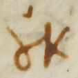 | ου | ж  | U+0436  |
| 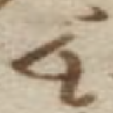 | ει | Ⴁ  | U+10A1 |
| 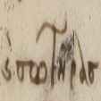 | καὶ σωτHρας | ϗ σωτHρας | U+03D7 |
| 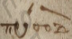 | \-ρο- | ల | U+0C32 |
| 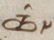 | τῶν | ȸ \+ ῀ | U+0238 \+ U+1FC0 |

3. # SuperScripts

| Image | Explanation | Unicode representation | Code |
| :---: | :---: | :---: | :---: |
| 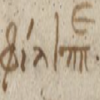 | Transcribe at the end of the final “π” as superscript | φίλιππᵉ | U+1D49 |

4. # LowerScripts

| Image | Explanation | Unicode representation | Code |
| :---: | :---: | :---: | :---: |
| 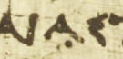 | Α expunctuated (= cancelled) | Α̣ | U+0323 \+ the dotted letter |
| 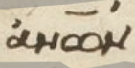 | Σ expunctuated with a dot both below and above  | Σ̣̇ | Σ  \+ U+0307 (dot above) \+  U+0323 (dot below) |

5. # Nomina Sacra

| Image | Explanation | Unicode representation | Code |
| :---: | :---: | :---: | :---: |
| 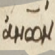 | ἀνθρώπων | ἀνών¯ | U+00AF |
| 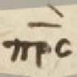 | πατρὸς | πρς¯\` | U+00AF \+ U+0060 |

6. #  Letters : allographs

   **⚠ Warning :** it has been discussed that ***allographs*** should be maintained in their primary form.  
   Example :

σ:  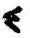 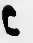/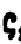  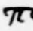  
π: 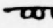   
β:  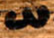

| Image | Explanation | Unicode representation | Code |
| :---: | :---: | :---: | :---: |
|  | omega capital  | Ω | U+03A9  |
| 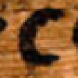 | lunate sigma capital | Σ | U+03A3 |
| 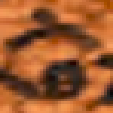 | lambda above another letter | ^  | U+005E |
|  | ε | ε | U+03B5 |
|  | ε | Ε | U+0395  |
|  | capital alpha above sampi \= Α’ \= 1.000 | A' | U+0027 |

7. # Deletions

| Image | Explanation | Unicode representation | Code |
| :---: | :---: | :---: | :---: |
|  | Erased letter Cf. https://catmus-guidelines.github.io/html/guidelines/en/corrections\_and\_others.html | θ  | U+27E6 (opening) U+27E7 (closing) |

8. #  Insertions

| Image | Explanation | Unicode representation | Code |
| :---: | :---: | :---: | :---: |
|  | ἀπαταιῶνος with αι striked through, corrected with an ε interlinear (=ἀπατεῶνος) | ἀπατ~~α~~ᵉιῶνος | U+002F \+ U+1D49 (/ and ᵉ) |
|  | insertion of a δ in the supralinear space  | ΒΟΡΕΑᴰΙΑι | U+1D30 |

9. # Punctuation marks

| Image | Explanation | Unicode representation | Code |
| :---: | :---: | :---: | :---: |
|  | paragraphos | ⸏ | U+2E0F  |
|  | end of an epigram | :— | U+003A \+ U+2014 |
|  | start of an epigram | ⨍ | U+2A0D |
|  | start of an epigram | \- | U+002D |
|  | coronis | ⸎ | U+2E0E |

10. # Numerals

| Image | Explanation | Unicode representation | Code |
| :---: | :---: | :---: | :---: |
|  | 10 (indicate numerals with a macron (¯) above or after the number) | ι̅ | U+00AF |
|  | 10 (indicate numerals with a macron (¯) above or after the number) | ιβ̅ | U+00AF |

11. # Miscellaneous

| Image | Explanation | Unicode representation | Code |
| :---: | :---: | :---: | :---: |
|  | pointed asterisk | ※  | U+203B |
|  | ? | ⁘  | U+2058 |
|  | ? | : ⎯  | U+003A \+ U+23AF |
|  | ? | ⩫  | U+2A6B |
|  | ? | ¬  | U+00AC |

# 

